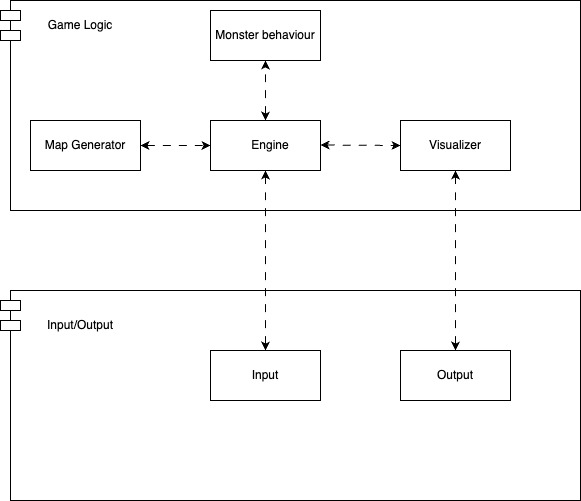
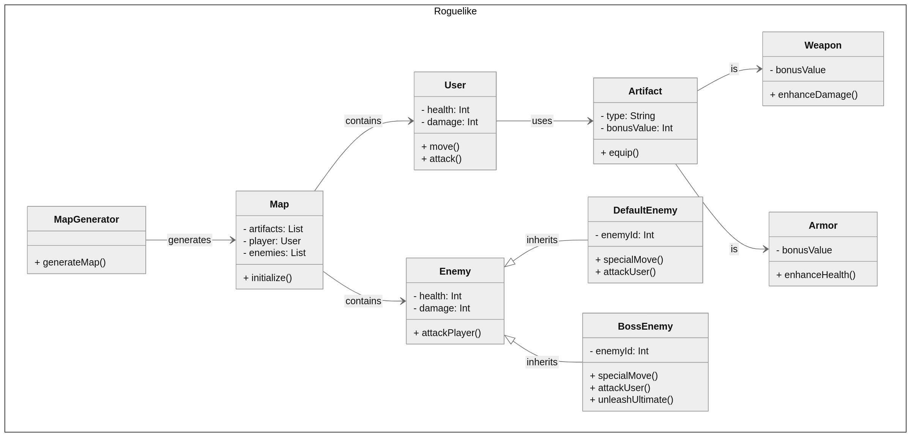
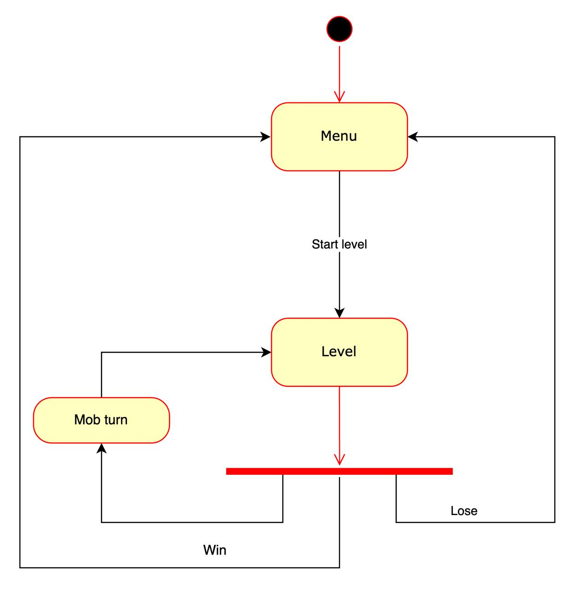

# ITMO-System-Design-2

## Roguelike

### Общие сведения о системе:

Разрабатывается MVP простой игры в жанре [Roguelike](https://ru.wikipedia.org/wiki/Roguelike). 
#### Общая концепция игры: 
Игрок появляется в процедурно (случайно) сгенерированном подземелье, состоящим из комнат, противников, 
находящихся в них, и артефактов, которые могут увеличивать здоровье или урон. 
Далее происходит пошаговое взаимодействие - на каждом ходу игрок выбирает одно из доступных действий: движение или атака. 
Целью игры является найти и победить финального босса. 

### Architectural drivers:

#### Технические ограничения:
Подразумевается наличие клавиатуры и устройства вывода. 

#### Функциональные требования:
1) Персонаж игрока, способный перемещаться по карте, управляемый с клавиатуры;
2) Карты генерируются случайно;
3) Характеристики - здоровье и сила атаки;
4) Инвентарь, состоящий из вещей, добавляющих здоровье и урон;
5) Пошаговое взаимодействие

### Роли и случаи использования:
Роль игрока в **Roguelike** заключается в прохождении случайно генерируемых уровней, 
исследовании мира Игрок должен найти и победить финального босса с помощью найденных усилений.
#### Некоторые случаи использования roguelike:
 * Исследование мира. В каждом новом прохождении это исследование нужно начинать с самого начала, так как уровни генерируются случайным образом. 
 * Истребление монстров. Концепция игры «один против всех». 

### Композиция (диаграмма компонентов)

### Логическая структура (диаграмма классов)

### Взаимодействия и состояния (диаграммы последовательностей и конечных автоматов)

