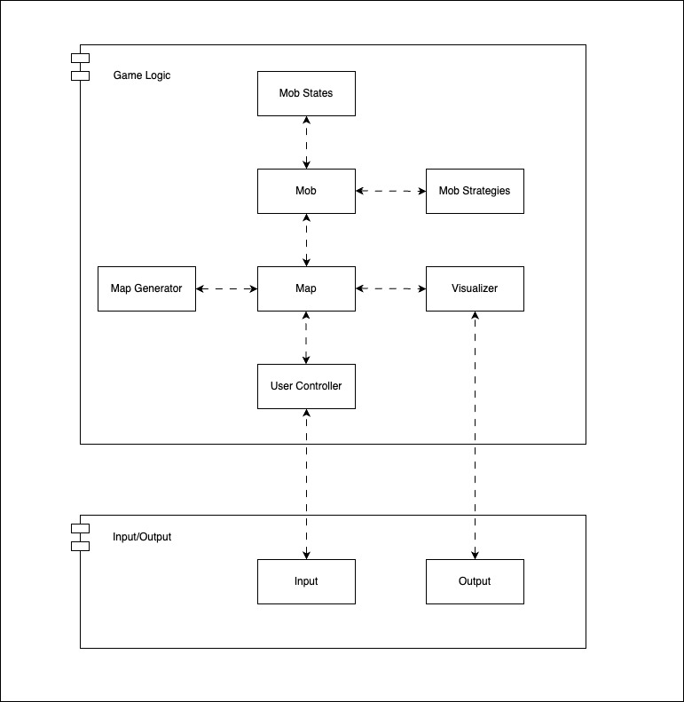

# ITMO-System-Design-2

## Roguelike

### Общие сведения о системе:

Разрабатывается MVP простой игры в жанре [Roguelike](https://ru.wikipedia.org/wiki/Roguelike). 
#### Общая концепция игры: 
Игрок появляется в процедурно (случайно) сгенерированном подземелье, состоящим из комнат, противников, 
находящихся в них, и артефактов, которые могут увеличивать здоровье или урон. 
Далее происходит пошаговое взаимодействие - на каждом ходу игрок выбирает одно из доступных действий: движение или атака. 
Целью игры является найти и победить финального босса. 

### Запуск

```
poetry install
python3 roguelike/main.py
```

Если Вы столкнулись с ошибкой:
```
ModuleNotFoundError: No module named 'tkinter'
```

То необходимо в системный **python3** установить пакет `python3-tk`:  
* Linux
```
   sudo apt-get install python3-tk
```

* Mac
```
   brew install python3-tk
```


### Architectural drivers:

#### Технические ограничения:
Подразумевается устройство ввода (клавиатура) и устройства вывода (монитор). 

#### Функциональные требования:
1) Персонаж игрока, способный перемещаться по карте, управляемый с клавиатуры;
2) Карты генерируются случайно;
3) Характеристики - здоровье и сила атаки;
4) Инвентарь, состоящий из вещей, добавляющих здоровье и урон;
5) Пошаговое взаимодействие

### Роли и случаи использования:
Роли:
1. Игрок:

   - Контролирует персонажа через клавиатуру.
   - Взаимодействует с игровым окружением и объектами.
   - Управляет инвентарем и экипировкой персонажа.

2. Разработчик/Дизайнер уровней:

   - Разрабатывает уникальные уровни и сценарии.
   - Настраивает параметры для генерации карт.
   - Добавляет новые объекты, врагов и предметы.

Сценарии:
1. Сценарий 1: Перемещение персонажа

   - Игрок использует клавиши для перемещения по карте.

2. Сценарий 2: Взаимодействие с айтемами

   - Игрок собирает мечи и щиты.

3. Сценарий 3: Управление инвентарем

   - Игрок надевает и снимает экипировку.

4. Сценарий 4: Сражение с врагами

   - Игрок атакует противников, применяя навыки и предметы для победы.

5. Сценарий 5: Смерть

   - Персонаж погибает и игра заканчивается.

### Описание типичного пользователя

Человек 20-40 лет, любящий ретро-игры, желающий улучшать свои навыки и преодолевать трудности.


#### Некоторые случаи использования roguelike:
 * Исследование мира. В каждом новом прохождении это исследование нужно начинать с самого начала, так как уровни генерируются случайным образом. 
 * Истребление монстров. Концепция игры «один против всех». 

### Композиция (диаграмма компонентов)
Помогает понять, как различные части системы связаны друг с другом.  


### Логическая структура (диаграмма классов)
Предоставляет комплексный, достаточно подробный взгляд на систему, позволяя увидеть, как различные элементы взаимодействуют друг с другом.


### Взаимодействия и состояния (диаграммы последовательностей и конечных автоматов)

#### Диаграмма конечных автоматов
Используется для описания поведения системы, показывая переходы из одного состояния в другое в зависимости от входных данных.


#### Диаграмма последовательностей
Показывает, как объекты взаимодействуют друг с другом через обмен сообщениями в определенной последовательности.


### Мотивация выбора библиотеки turtle для разработки игры roguelike
#### Преимущества библиотеки Turtle для разработки игр
**Библиотека Turtle** в Python — это простая и интуитивно понятная графическая библиотека, 
поставляемая в базовом пакете **Python3**.

Данный пакет отлично подходит для разработки несложных проектов с 2D анимацией, 
коим является создаваемая игра в стиле **roguelike**.   
API библиотеки простое и интуитивно понятное, 
отлично подходит новичкам в области создания графических приложений и gamedev.  
Кроме того, библиотека **turtle** не является **roguelike** специфичной, что так же является изначальным требованием.  
Резюмируя, пакет **turtle** - отличный, легковесный вариант, 
с помощью которого можно реализовать MVP простой игры в жанре [Roguelike](https://ru.wikipedia.org/wiki/Roguelike), не углубляясь в специфику доменной области.
#### Аналоги библиотеки Turtle
Кратко отметим имеющиеся **Python** аналоги:
- **Pygame**: Это одна из самых популярных библиотек для разработки игр на Python. 
  Она предоставляет более широкий набор инструментов для работы с графикой, 
  звуком и событиями, что делает её хорошим вариантом для создания более сложных игр.

- **Arcade**: Эта библиотека также предназначена для 2D-игр и предлагает более современный подход к разработке, с поддержкой OpenGL и более удобным API.

- **Pyglet**: Этот пакет используется создания игр и мультимедийных приложений, поддерживает 2D и 3D графику, а также работу со звуком.

### [Документация по разработке](./SETUP.md)